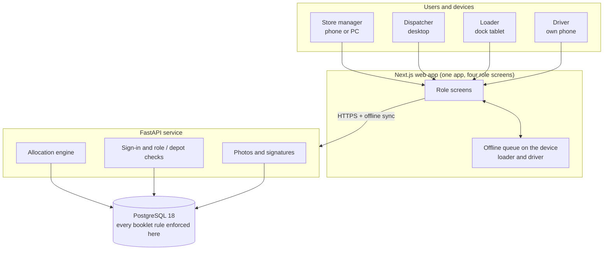
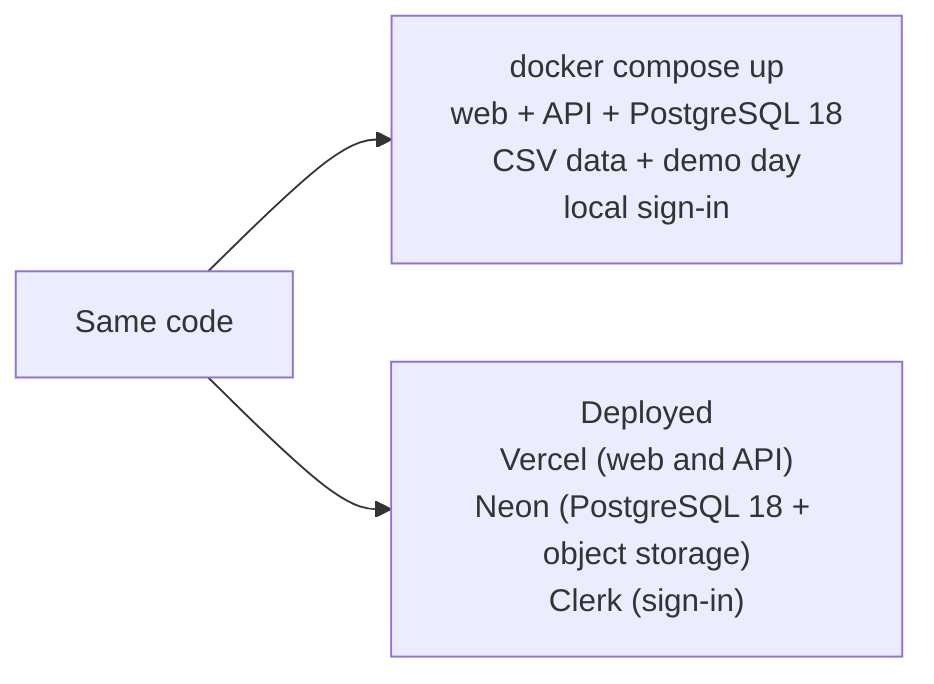
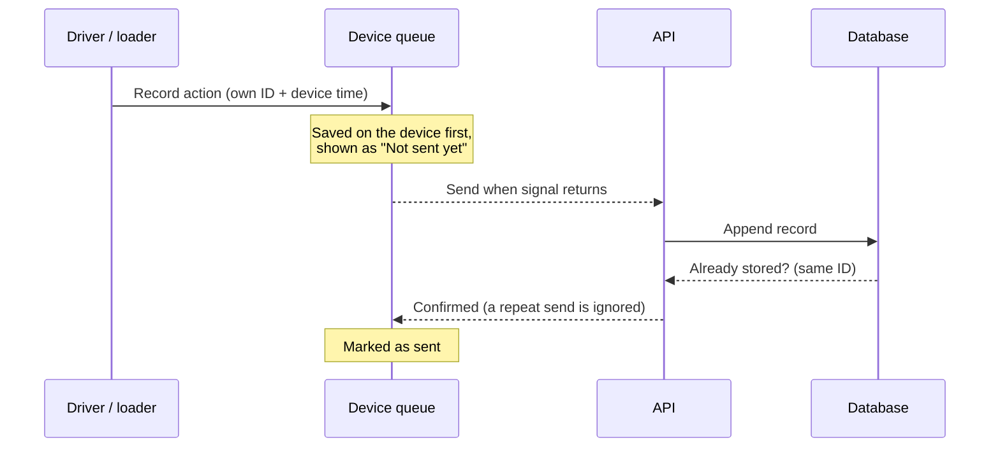
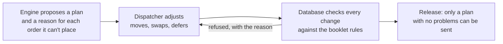

# Architecture · Waypoint (Team AlphaZero)

One web app serves all four roles and talks to one API. The database guards every booklet rule. The same code runs in Docker for the judges and on Vercel, Neon and Clerk when deployed.

Related docs: [Database and data model](database.md) · [Data flow](data-flow.md) · [API](api.md) · [UX by role](ux-by-role.md)

---

## System overview

### Two ways to run the same code

---

## Components

| Component | Responsible for | Not responsible for |
|---|---|---|
| **Web app** (Next.js) | The four role screens, sized for each device; the offline queue; showing what the API returns | Business rules |
| **Offline queue** (loader and driver devices) | Saving each action on the device first, with its own ID and the device time, then sending it when signal returns | Deciding whether an action is valid |
| **API** (FastAPI) | Sign-in, role and depot checks on every request, input validation, rate and size limits, the allocation engine, photos and signatures | Re-implementing the booklet rules |
| **Allocation engine** | Proposing a plan and giving a reason for every order it cannot place | Having the last word: the dispatcher and the database do |
| **PostgreSQL 18** | All data, every booklet rule, the history of every change, one read view per screen | Anything about layout or devices |
| **Media storage** | Photos and signatures, served as short-lived signed links | Delivery records (those stay in the database) |
| **Sign-in** | Local demo accounts in Docker, Clerk when deployed | Deciding what a user may do (the API and database do) |

How the data moves through these parts, step by step, is in [data-flow.md](data-flow.md).

---

## Key decisions

| # | Decision | Why |
|---|---|---|
| 1 | **One web app with four role screens** (Next.js), not four separate apps | One codebase is faster to build and keeps the look consistent. Each role sees only its own screens, sized for its device: desktop for the dispatcher, tablet for the loader, phone for the driver and the store. |
| 2 | **A separate API service** (FastAPI, Python) | Business logic lives in one place that every screen uses. Python suits the allocation engine, and the API documents itself (OpenAPI at `/docs`). |
| 3 | **The database enforces the rules, not just the screens** | Weight, volume, chilled goods, van-only outlets, time windows, the fuel quota and the cutoff are all checked in PostgreSQL. A bug or a direct API call can't create an illegal plan, and a plan with any problem can't be sent. |
| 4 | **Planning: the engine proposes, the dispatcher decides, the database checks** | The engine builds a legal plan automatically and gives a reason for every order it can't place. The dispatcher can adjust it, and every manual change is validated. This covers all three options in the brief: automatic, assisted, and manual with validation. |
| 5 | **A simple, explainable engine** (greedy: scarcest resource first) | The dispatcher can understand and trust why each order went where it did, or why it waits. That matters more than a "black box" optimum. |
| 6 | **Offline first for loaders and drivers** | Docks and rural roads lose signal. Every action is saved on the device first and sent later. Each action has its own ID, so sending it twice never creates a duplicate. |
| 7 | **Records are never overwritten** (append-only) | Deliveries, load confirmations and status changes are only ever added. A correction sits beside the original, so disputes are settled from the record instead of from memory. |
| 8 | **Every deferral carries a reason, and the store is told** | This answers two problems the booklet names: stores never knowing what happened, and the dispatcher being unable to explain decisions. Outlets skipped twice in a row are flagged. |
| 9 | **People see only their own depot and data** | Loaders and drivers see only their own trips, and stores only their own outlet. The planning-office dispatcher can switch between both depots and watch them on one screen. This is enforced in the database. |
| 10 | **Two sign-in modes** | Local demo accounts let judges run Docker with no outside account. Clerk handles the deployed site. The API checks the user's role and depot on every request. |
| 11 | **Sri Lanka time everywhere, with the 16:00 cutoff on the clock** | Cutoffs, delivery windows and the Fresh 03:30 start must match the real day at the depot. Sunday is never an operating day. |
| 12 | **Live view refreshes every 15 seconds** (polling, not push) | Simple, reliable, and it works on serverless hosting. 15 seconds is fast enough for a dispatcher watching trips. |
| 13 | **Same code, two ways to run** | `docker compose up` starts everything, including the database, the CSV data and a demo day. Deployed, the same code runs on Vercel (web and API), Neon (PostgreSQL 18, the same version as in Docker) and Clerk. |
| 14 | **Photos and signatures stored safely** | In Docker they're kept in the database, so nothing outside is needed. When deployed they go to Neon object storage. Either way, viewers get short-lived signed links. |
| 15 | **Deliberately simple** (no Kafka, Airflow or microservices) | For a six-person part-time team and a 5-day hackathon, fewer moving parts means fewer failures and an easier demo. |
| 16 | **Secure by default** | Rate limiting, request size limits, security headers, explicit CORS and allowed hosts. In production, the API refuses to start if any of these is misconfigured. |
| 17 | **Tests check the rules independently** | The audit tests recompute every booklet rule straight from the CSVs, not from our own database, and run a full delivery day across both depots and every role. |

---

## Offline sync (loader and driver)

The server ends each action in one of three states: applied, waiting for something that has not arrived yet (for example a departure that reaches the server before the loader's release), or rejected with a reason the dispatcher can see. The data-level detail is in [data-flow.md](data-flow.md#4-device-events-at-the-entry-point).

---

## Planning: engine, dispatcher and database

- The engine places the scarcest resource first (refrigerated vehicles, van-only outlets, tight windows), then the rest.
- An order it cannot place waits with a reason. The dispatcher can defer it, and the store is told why.
- A manual change goes through the same checks as the engine's proposals. A refused move comes back with the reason in plain words.
- The database keeps the final say: a plan with any rule problem cannot be released, whoever built it.
- The list of rules the database checks is in [data-flow.md](data-flow.md#33-planning-d1).

---

## Access by role

| Role | Sees | Notes |
|---|---|---|
| **Store manager** | Their own outlet's orders, deliveries and notices | Places orders, confirms receipt |
| **Dispatcher** | Both depots, with a switch between them | Plans, defers, releases, watches both depots on one screen |
| **Loader** | Their own depot's trips and load lists | Confirms loading, flags shortfalls, releases a trip |
| **Driver** | Only their own trips | Records arrival, delivery and problems |
| **Admin** | Master data and users | |

- The database filters rows by the signed-in user, and every write checks the user's role and depot. A screen cannot show, and the API cannot change, what the role may not reach.
- The API connects to the database as a restricted role, not as its owner. It cannot truncate tables or change records that are append-only.
- Sign-in is local (demo accounts) or Clerk. Either way, the user ends up as one user record with a role and a depot, and that is what the checks use.

---

## Environments

| | Docker (judges) | Deployed |
|---|---|---|
| Start | `docker compose up` | Vercel, Neon and Clerk |
| Web and API | Containers | Vercel |
| Database | PostgreSQL 18 container | Neon, PostgreSQL 18 |
| Sign-in | Local demo accounts | Clerk |
| Photos and signatures | In the database | Neon object storage |
| Data | CSV data and a demo day loaded at start | Loaded from the CSV files |

- Same code and the same PostgreSQL major version in both, so the rules behave the same.
- The database's default schema is set on the database itself, not per connection, because Neon's connection pooler does not pass per-connection settings.
- In production the API refuses to start if rate limits, size limits, security headers, CORS or allowed hosts are missing.

---

## Quality checks

- **Rule tests on the database.** The schema has its own test file. It exercises the rules, the status changes, the append-only records and who can see what, inside one transaction that is rolled back.
- **Independent audit tests.** They recompute every booklet rule straight from the CSV files, not from our own tables.
- **Full-day test.** One delivery day across both depots and every role, from the first order to the store's receipt.
- **No avoidable deferrals.** The tests check that no order was deferred when a vehicle could legally have taken it.

---

## Trade-offs we accepted

| Trade-off | Why we accepted it |
|---|---|
| **Greedy engine, not a mathematical optimum** | It's explainable and fast. The tests check that no order was deferred when a vehicle could legally have taken it. |
| **Polling, not live push** | Simpler, and good enough at a 15-second refresh. |
