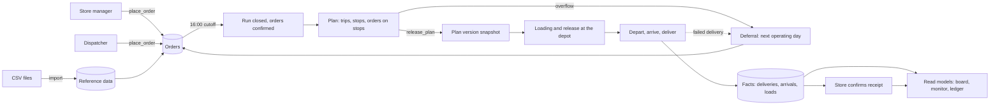
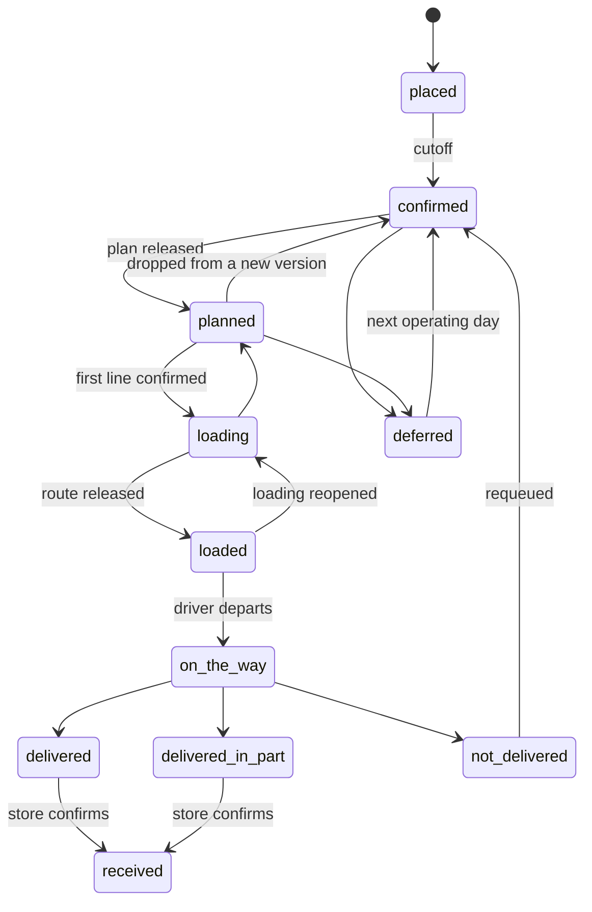

# Waypoint data flow

## 1. The whole flow



Three kinds of data move through the system:

| Kind | Examples | Rule |
|---|---|---|
| **Reference** | districts, vehicles, outlets, calendar | Loaded from the CSV files, edited by an admin, changes rarely |
| **Operational** | orders, plans, routes, stops | Edited while the day is being planned |
| **Facts** | deliveries, arrivals, load confirmations, receipts, status history | Append-only; a correction is a new row |

---

## 2. Where data comes from

| Source | What it supplies | Entry point |
|---|---|---|
| CSV files | districts and travel, service allowances, vehicles and fuel quotas, outlets and windows, calendar, road conditions, traffic speed | `waypoint_import.sql` |
| Store manager | orders, order changes, receipt confirmations | `place_order`, `amend_order`, `confirm_receipt` |
| Dispatcher | orders on behalf of stores, plans, deferrals, instructions | `place_order`, `create_plan`, `assign_order`, `defer_order`, `release_plan`, `send_instruction` |
| Loader tablet | line confirmations, shortfall flags, route release | `ingest_event` (device events) |
| Driver phone | departure, arrival, delivery, problem flags | `ingest_event` (device events) |
| System jobs | cutoff, retrying events that arrived early | `cutoff_sweep`, `apply_pending_events` |

Every write carries a `user_id`. Device events also carry `device_id`, a per-device sequence number and the time on the device.

### CSV import

| File | Rows | Goes to |
|---|---|---|
| `district_travel.csv` | 12 | `district` |
| `service_allowance.csv` | 9 | `service_allowance` (planning allowance per stop, by brand and dock type) |
| `vehicles.csv` | 60 | `vehicle` (capacity, km per litre), `fuel_quota` (litres per week) |
| `outlets.csv` | 120 | `outlet`, `outlet_window` (one window per outlet, Monday to Saturday; mall outlets get a mall-access window) |
| `calendar.csv` | 910 | `calendar_day` (operating flag, payday, holiday, monsoon, festival ramp) |
| `road_conditions.csv` | 10,920 | `road_condition` (daily disruption index per district) |
| `traffic_speed.csv` | 576 | `traffic_speed` (district, hour, monsoon) |

The import checks that every district, depot, brand, dock type and vehicle type matches, runs in one transaction and can be run again. Days outside the calendar default to Monday to Saturday.

---

## 3. Stage by stage

### 3.1 Placing an order

| | |
|---|---|
| **Trigger** | Store manager submits an order, or a dispatcher enters one |
| **Reads** | `outlet`, `product`, `calendar_day`, `run` |
| **Writes** | `order_header` (status `placed`), `order_line`, `outlet_usual_line`, `notice` (order confirmed), `order_status_history` |
| **Deletes** | the matching `order_draft` |

1. `order_slot()` tells the store the next operating day whose cutoff is still open, and the countdown. There is no fixed weekday schedule per outlet.
2. `place_order()` picks the delivery day with `next_delivery_date()`: the requested day if it is an operating day with an open cutoff, otherwise the next one.
3. It creates the day's `run` for the depot if needed (`get_run`, cutoff 16:00 on the previous working day, depot time).
4. Lines must be distinct, active products of the outlet's brand and the order's temperature class.
5. Weight and volume are summed from the lines onto `order_header` (or passed in when only totals exist).
6. Only one regular order per outlet, day and temperature class. Moved orders may share a day.
7. The order only exists once it has a confirmation number. `client_request_id` makes a retry return the same order.

`amend_order()` rewrites the lines while the order is still `placed` (before cutoff). After that, lines are locked.

### 3.2 Cutoff

`cutoff_sweep()` finds runs whose `cutoff_at` has passed and calls `close_run()`:

- `run.state`: `open` → `closed`
- every `placed` order in the run: `placed` → `confirmed` (source recorded as `system`)

### 3.3 Planning (D1)

| | |
|---|---|
| **Reads** | confirmed orders of the run, `vehicle`, `district`, `service_allowance`, `outlet_window`, `fuel_quota` |
| **Writes** | `plan`, `route`, `stop`, `stop_order` |

1. `create_plan()` makes one plan per run.
2. The dispatcher adds **routes** (a trip: one vehicle, one brand, one district, sequence 1 or 2) and **stops** (one outlet each).
3. `assign_order()` puts an order on a stop. It calls `fit_violations()` first and refuses with the reason in words if the trip cannot take the order. The same check dims vehicles on the board while the dispatcher works.
4. `retime_route()` fills in the numbers (below).
5. `seed_plan_from_previous()` can copy a brand's trips from an earlier plan and attach this run's orders where they fit.
6. Orders with no stop appear in `unplanned_orders`, ranked first come first served by `placed_at`.
7. Any edit to a released plan sets `plan.dirty`, so the next release records what changed.

**Trip time and distance** (`trip_minutes`, `retime_route`):

```
trip_minutes = outbound travel
             + inter-stop travel × (orders − 1)
             + service allowance for every order
```

- Travel uses free-flow minutes from `district`. Road disruption and traffic speed are not used in planning.
- The first stop's arrival is departure plus outbound travel. Each later arrival adds the previous stop's service time and one inter-stop leg.
- A vehicle that arrives before an outlet's window opens waits: planned arrival is the window opening, and the return time covers the wait.
- Route distance includes the return leg. That distance divided by the vehicle's `km_per_l` gives the fuel drawn from the weekly quota.
- The allowance is a planning allowance, not an observed duration (`service_source = 'standard'`).

**Rules checked at assign time and again at release** (`plan_violations()` returns every blocker; an empty result means the plan can be released):

| Code | Rule |
|---|---|
| `brand`, `district`, `depot` | One brand and one district per trip; outlet served from the vehicle's own depot |
| `temperature` | Chilled and frozen only on refrigerated vehicles |
| `van_only` | Van-only outlets only on vans |
| `weight`, `volume` | Trip total within the vehicle's capacity |
| `vehicle_unavailable` | Vehicle in the workshop (`vehicle.active = false`) cannot be planned |
| `time_budget` | Per vehicle per day: Fresh trips ≤ 270 min, Style + Tech trips ≤ 480 min |
| `fresh_window` | Fresh trips depart no earlier than 03:30 |
| `trip_time` | A trip is scheduled at least as long as its trip time |
| `fuel` | Weekly fuel quota (hard) |
| `window` | Planned arrival inside the outlet's window for that weekday |
| `deadline` | Arrival no later than `stop.deliver_by` |
| `stop_time` | Stop times fall inside the trip's departure and return |
| `empty_stop` | No stop without orders |
| `vehicle_overlap` | A vehicle's trips do not overlap, including trips in other released plans |
| `order_locked` | Orders already loading, loaded or on the road stay on their trip |
| `unplanned` | Every confirmed order has a stop or a drafted deferral |

Also enforced by the database itself: at most two trips per vehicle per day, whole orders only (one live stop per order per plan), and an order can only go on a stop of its own outlet.

### 3.4 Overflow and deferral

| | |
|---|---|
| **Reads** | `overflow_candidates` (suggested reason, last five working days per outlet, skip streak) |
| **Writes** | `deferral_draft`, then `deferral`, `notice`, `order_header` |

1. `draft_deferral()` records a tentative decision: removes the order from its stop and stores reason and note. Nothing moves yet.
2. `confirm_deferrals()` applies all drafts. For each order `defer_order()`:
   - finds the next operating day (`next_delivery_date`),
   - writes a `deferral` row (who, why, from date, to date, whether it is a consecutive skip),
   - moves the order: `deferral_count` + 1, new `delivery_date`, new `run_id`, status back to `confirmed`,
   - writes a `notice` to the store with the reason in the store's wording.
3. A reason of "other" needs a note.

A deferral is a delay, not a cancellation. `deferred` is a transient status inside that transaction and never a resting state.

A failed delivery follows the same path through `requeue_order()` (reason scope `not_delivered`).

### 3.5 Release

`release_plan()` for a plan:

1. Locks the plan and runs `plan_violations()`. Any blocker stops the release with the list of problems.
2. Writes an immutable `plan_version` snapshot: routes, stops, outlets, orders, lines, proof rule.
3. From the second release on, writes `plan_change` rows for routes that differ from the previous version.
4. Writes `notice` rows (arrival window, planned arrival ± 15 minutes) for orders that are new or whose arrival moved.
5. Order status: kept orders `confirmed` → `planned`; dropped orders `planned` → `confirmed`.
6. `plan.version` + 1, `plan.dirty` cleared, `run.state` → `planned`.

A plan with no changes returns its current version.

### 3.6 Loading

| | |
|---|---|
| **Reads** | `device_sync_payload()` (latest snapshot for the depot, unacknowledged plan changes, unseen instructions), `load_list` |
| **Writes** | `device_event`, then `load_confirmation`, `flag`, `plan_change_ack`, `route_release` |

| Event | Effect |
|---|---|
| `load_confirm` | One `load_confirmation` per line with the quantity loaded and plan version. Order `planned` → `loading`; route `planned` → `loading` |
| `flag` (loader) | `flag` row (missing, short, damaged). The dispatcher replies with `send_instruction`, which moves the flag to `replied` |
| `plan_ack` | `plan_change_ack` for the loader |
| `route_release` | Needs every line confirmed (otherwise held as pending) and every plan change acknowledged (otherwise rejected). Writes `route_release` with final weight and volume. Route → `loaded`, orders → `loaded`. Writes a `short_loaded` notice per order with short lines |
| `route_reopen` | Route and orders back to `loading` |

Stops are listed last stop first, so the truck is loaded in reverse order.

### 3.7 On the road

| Event | Effect |
|---|---|
| `depart` | Needs the route `loaded` (otherwise held as pending). Route → `on_the_way`, orders → `on_the_way`, run → `in_progress` |
| `arrive` | `stop_arrival` (one per stop) |
| `delivery` | `delivery` and one `delivery_line` per order line: ordered, expected, delivered quantity |
| `flag` (driver) | `flag` row (running late, cannot reach, outlet closed, vehicle problem, load problem, other) |
| `plan_ack`, `instruction_on_phone`, `instruction_seen` | `plan_change_ack`; instruction moves to `on_phone`, then `seen` |

What `delivery` does:

- **Expected quantity** is the quantity the loader recorded (never above ordered), so a shortfall at loading is not counted against the driver.
- **Consistency:** a delivery covers every order line; "delivered" has no short line; "delivered in part" has at least one; a short line needs a reason.
- **Status** moves along the spine to match the fact (`delivered`, `delivered_in_part` or `not_delivered`), writing history that says it was advanced.
- **Facts win:** if the dispatcher moved the stop while the phone was offline, the delivery stands, the other assignment is closed and a `plan_conflict` row tells the dispatcher.
- **Store notice:** `receipt_needed` for delivered orders, `not_delivered` for failed ones.
- **Completion:** when every live order on a route has a delivery, the route is `complete`; when all routes are complete, the run is `complete`.
- **Corrections** append a new delivery with `supersedes_id`. `current_delivery` shows the latest in each chain.

**Proof of delivery:** one rule for all outlets, signature and photo. Files arrive as `attachment` rows, possibly after the delivery. `delivery_proof_status` reports what is present against the rule. It is informational and never blocks a delivery.

### 3.8 Store receipt

`confirm_receipt()` on a `delivered` or `delivered_in_part` order:

- writes `store_receipt` (all OK or not),
- writes a `receipt_issue` per reported line (short, damaged, wrong item, not received) with a reference number,
- order → `received`.

Calling it again returns the same receipt. A manager can confirm only their own outlet's orders.

---

## 4. Device events at the entry point

Every driver and loader action arrives as one `device_event`. `ingest_event()`:

1. checks the device is registered and the user is allowed on it (a driver phone belongs to one driver; a loader tablet accepts only loaders),
2. measures clock skew against server time and flags it above the tolerance (120 s),
3. inserts the event (a repeat of the same `event_id` is ignored and still acknowledged),
4. updates the device's last-contact time,
5. calls `apply_event()`, which runs the handler for the event type.

Each event ends in one of three states:

| Outcome | Meaning |
|---|---|
| **applied** | Rules passed; facts written |
| **pending** | Waiting for something that has not arrived yet (for example a `depart` before the loader's release). `apply_pending_events()` retries; events pending more than 6 hours are rejected |
| **rejected** | Failed a rule, with the reason stored. Rejections appear in the D3 list |

Event types: `heartbeat`, `depart`, `arrive`, `delivery`, `flag`, `load_confirm`, `route_release`, `route_reopen`, `plan_ack`, `instruction_on_phone`, `instruction_seen`.

Both clocks are kept: `device_time` (when it happened) and `received_at` (when the server learned of it).

---

## 5. Order status



- Legal changes are listed in `order_status_transition`. A trigger rejects anything else.
- Every change writes `order_status_history` with actor and source (`app`, `device`, `system`).
- Status is a summary. The detail is in the fact tables; when they disagree, the facts are right.
- A driver correction before the store confirms can switch between `delivered`, `delivered_in_part` and `not_delivered`.

---

## 6. Where each piece of data lives

| Data | Table | Written by | Mutable? |
|---|---|---|---|
| Order and lines | `order_header`, `order_line` | `place_order`, `amend_order` | Lines until cutoff; status by rule |
| Order status trail | `order_status_history` | trigger | Append-only |
| Run and cutoff | `run` | `get_run`, `close_run` | State only |
| Plan | `plan`, `route`, `stop`, `stop_order` | dispatcher functions | Yes (soft removal on stops and assignments) |
| Plan versions | `plan_version` | `release_plan` | Append-only |
| Plan changes | `plan_change`, `plan_change_ack` | release, devices | Append / acknowledge |
| Deferral drafts | `deferral_draft` | `draft_deferral` | Yes, deleted on confirm |
| Deferrals | `deferral` | `defer_order`, `requeue_order` | Append-only |
| Device events | `device_event` | `ingest_event` | Append-only; outcome set once |
| Arrivals | `stop_arrival` | `arrive` | Append-only |
| Loading | `load_confirmation`, `route_release` | `load_confirm`, `route_release` | Append-only |
| Flags and instructions | `flag`, `instruction` | devices, dispatcher | State changes only |
| Deliveries | `delivery`, `delivery_line` | `delivery` | Append-only |
| Proof files | `attachment` | upload | Append-only |
| Receipts and issues | `store_receipt`, `receipt_issue` | `confirm_receipt` | Append-only |
| Store notices | `notice` | functions | Marked read |
| Plan conflicts | `plan_conflict` | `apply_delivery` | Acknowledged |
| Audit | `audit_log` | trigger | Append-only |
| Predictions | `prediction` | later | Empty today |

---

## 7. What each screen reads

Screens read views and functions, not base tables. Every view returns only what the signed-in user may see.

| Screen | Reads |
|---|---|
| D1 Plan board | `plan_summary`, `route_board`, `unplanned_orders`, `fit_violations()`, `plan_violations()`, `fuel_week`, `road_disruptions` |
| D2 Overflow | `overflow_candidates`, `outlet_run_history` |
| D3 Live monitor | `run_progress`, `monitor_exceptions`, `fleet_status` |
| D4 Ledger | `ledger`, `ledger_headline`, `deferrals_per_day`, `current_delivery`, `delivery_proof_status`, `service_time_actual` |
| L Loader | `route_board`, `load_list`, `device_sync_payload()` |
| R Driver | `device_sync_payload()` (the released snapshot, plan changes, instructions) |
| S Store | `store_orders`, `order_timeline`, `receipt_comparison`, `order_form_defaults`, `order_slot()`, `notice` |

`monitor_exceptions` ranks nine kinds of problem: failed delivery, driver report, short load, no signal, late, loader flag, plan conflict, unseen instruction and rejected event. No signal means the driver's device has been silent for 20 minutes on a live route; late means a stop is overdue (10 minutes' grace) while the device is still in contact.

`service_time_actual` puts the observed time at a stop (arrival to delivery) beside the planning allowance. It is the input a later prediction would learn from.

---

## 8. History and audit

| Question | Answer comes from |
|---|---|
| What happened to this order, and when? | `order_status_history` |
| Why was it moved, who decided, did the store know? | `deferral` and `notice` |
| What did the plan say when it was released? | `plan_version` |
| What changed between two releases? | `plan_change` |
| Who changed a plan, stop, assignment or master record? | `audit_log` (old and new row, actor) |
| What did the phone send, and was it accepted? | `device_event` |
| What was delivered, by whom, with what proof? | `delivery`, `delivery_line`, `attachment` |
| What did the store report? | `store_receipt`, `receipt_issue` |

Order headers are not audited row by row; `order_status_history` already records every status change.
