# Deviations from the Designathon Submission

The largest change was to the Dispatcher UI. Small changes were made to the screens of the other roles.

`before · feature/wire` · `after · frontend_v2`

[Dispatcher](#dispatcher) · [Driver](#driver) · [Loader](#loader) · [Store manager](#store-manager) · [New screens](#new-screens) · [Bugs fixed](#bugs-fixed-on-the-way)

---

## Dispatcher

The screen previously had coded tabs, a long column of large vehicle cards, and no clear next step. Now the day is a five-step strip with one main button that is always the next thing to do. This was motivated by the following constraint given in the booklet:
> **Works at a large screen in the planning office with a stable connection.**

| Needs | → Where the app answers it |
|---|---|
| a plan that respects every restriction | the engine builds it; every booklet rule is checked on each change and a plan that breaks one cannot be sent |
| visibility after vehicles leave the depot | Live: trips sorted by risk, stops done, alerts with replies (Send partial, Hold vehicle) |
| to explain deferral decisions | each deferral carries the reason the store is told; Try to fit shows every vehicle and the rule that blocks it |
| to see outlets already skipped | last 5 runs per deferred order and a "Skipped last run too" flag; Records filter for outlets skipped 2+ runs in a row |

<table>
<tr><th align="left">✗ BEFORE</th><th align="left">✓ AFTER</th></tr>
<tr>
<td valign="top" width="50%">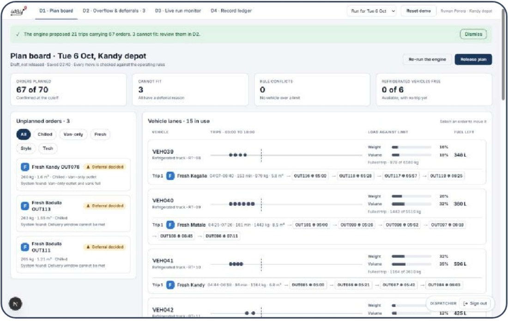</td>
<td valign="top" width="50%">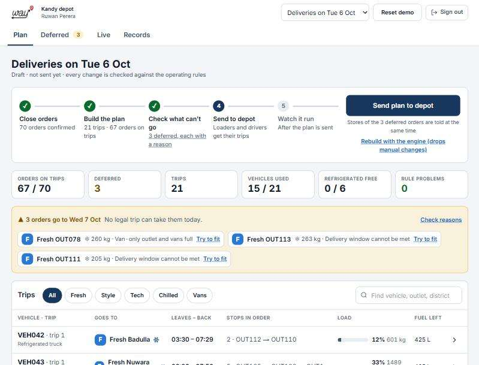</td>
</tr>
<tr><td valign="top">D1 · Plan board after the engine ran: about three vehicles per screen.</td><td valign="top">Plan: steps, one main button, deferred orders with their reasons, trips as one row each.</td></tr>
</table>

| ✗ BEFORE | ✓ AFTER |
|---|---|
| Tabs named by spec codes: D1 · Plan board, D2 · Overflow & deferrals, D3, D4 | Plain names: Plan · Deferred · Live · Records, with a count on Deferred |
| Buttons in different places at each stage; the next step had to be worked out | Close orders → Build the plan → Check what can't go → Send to depot → Watch it run, one main button |
| One large card per vehicle (gauges, timeline dots, stop chips) | One row per trip: vehicle, brand + district, leaves–back, stops, load %, fuel; details open on tap |
| Before planning, all 70 orders showed "Cannot fit" | Nothing is "deferred" until the engine has run |
| VEH039 on the plan, AV-03 / RV-03 on the live monitor | One name everywhere: VEH057 in plan, live view, loader, driver |
| Header crowded with name, depot, date picker and reset | Depot and name grouped; sign-out in the header; works on a phone (steps stack) |

<table>
<tr><th align="left">✗ BEFORE</th><th align="left">✓ AFTER</th></tr>
<tr>
<td valign="top" width="50%">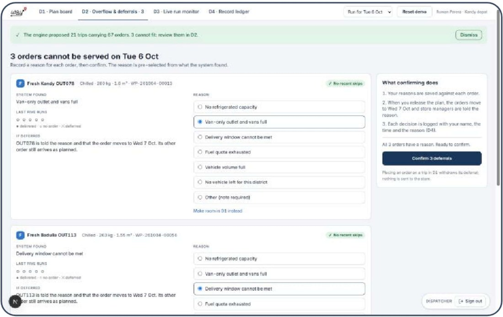</td>
<td valign="top" width="50%">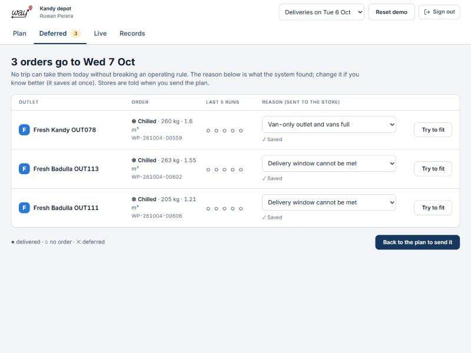</td>
</tr>
<tr><td valign="top">D2 · seven radio buttons per order, then "Confirm", then back to D1 to release.</td><td valign="top">Deferred: one row per order, reason pre-filled and saved at once, "Try to fit" beside it.</td></tr>
</table>

| ✗ BEFORE | ✓ AFTER |
|---|---|
| A separate Confirm step for reasons the engine had already set | Reasons save the moment you change them; stores are told when the plan is sent |
| Choosing "Other" was refused before the note could be typed | "Other" waits for the note, then saves both together |
| "Make room in D1 instead" link, no help finding a trip | "Try to fit" lists every vehicle and the rule that blocks it (see [New screens](#new-screens)) |

---

## Driver

A button telling the driver the next thing to do, was added near the thumb zone.
> **Works on the road with a personal phone,**

| Needs | → Where the app answers it |
|---|---|
| a run sheet that stays current | My run on the phone, kept offline; dispatcher messages appear on it with an "OK, got it" button |
| to record outcomes and proof, so disputes do not rest on memory | All delivered / Some missing / Not delivered, who took it, signature, photo; corrections sit beside the original |
| to work offline and sync later | every record is saved on the phone first and sent by itself when signal returns; resending never duplicates |
| use only when safely stopped | one large button per step (Start trip, I'm here, Deliver), so each action is a single tap at the stop |

**✗ BEFORE**

The sign-out badge covered the bottom.

**✓ AFTER**

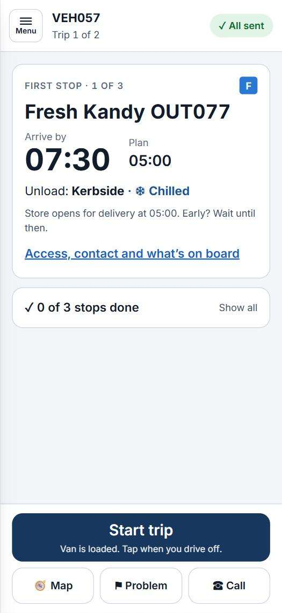

Full screen. One big next step: Start trip → I'm here → Deliver.

| ✗ BEFORE | ✓ AFTER |
|---|---|
| "Navigate" and "Open stop"; arriving and delivering were a screen away | One 64 px button that is always the next step, with a line saying what it does |
| Bare hamburger icon; menu listed screens by code (R1, R2, R3 ...) and states like "Driving" | Labelled "Menu" button; only My run, Report a problem, Call, Simulate no signal, Sign out |
| "In full / In part", "Received by", "Quantities handed over" | "All delivered / Some missing / Not delivered", "Taken by", "Tap – for missing items" |
| A 360 px phone drawn inside the real phone; floating badge over the buttons | Full screen with safe-area padding; sign-out inside the menu |
| Hydration error on every load (server and phone rendered different text) | The phone's saved run is read only after the page hydrates: no error |
| "Offline · 2 to send" next to "1 saved on phone" (two different counts) | "No signal · 2 to send" and "1 delivery not sent": each count says what it counts |

---

## Loader

The dark dock design worked, so the changes are targeted: the number a loader counts is now the biggest thing on the line, the header no longer overlaps, and the tablet works in portrait as well as landscape.
> **Works at the Peliyagoda or Kandy warehouse dock on a shared tablet or terminal.**

| Needs | → Where the app answers it |
|---|---|
| lists that never go stale | the load list comes from the sent plan; a re-sent plan marks the changed trips until the loader opens them |
| the stop sequence, to load for unloading | "Load in this order: last stop first"; stops listed in loading order |
| to flag missing or damaged items before the vehicle leaves | Flag on every line (Missing, Short, Damaged); the dispatcher gets it at once and the departure check shows it before release |

<table>
<tr><th align="left">✗ BEFORE</th><th align="left">✓ AFTER</th></tr>
<tr>
<td valign="top" width="50%">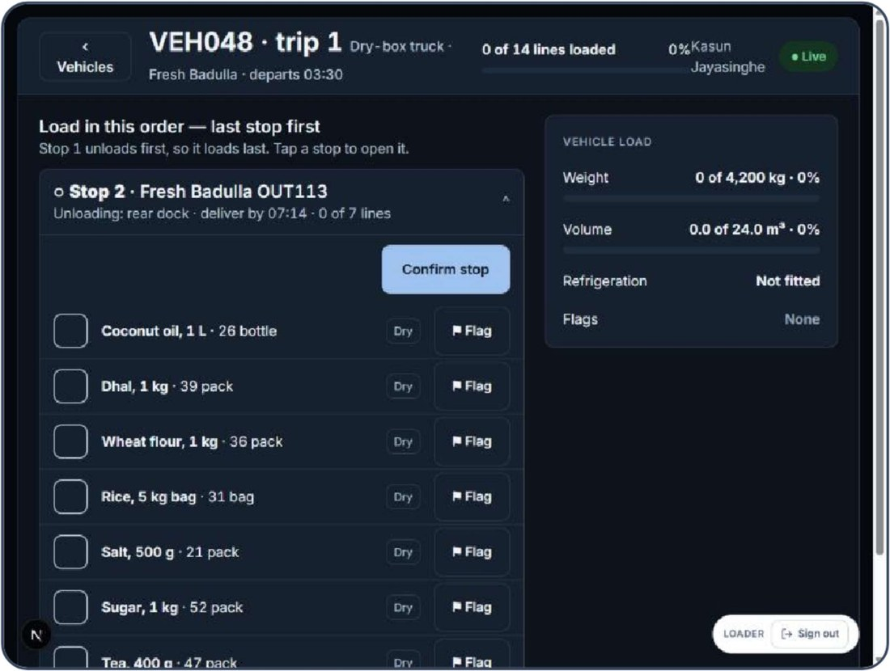</td>
<td valign="top" width="50%">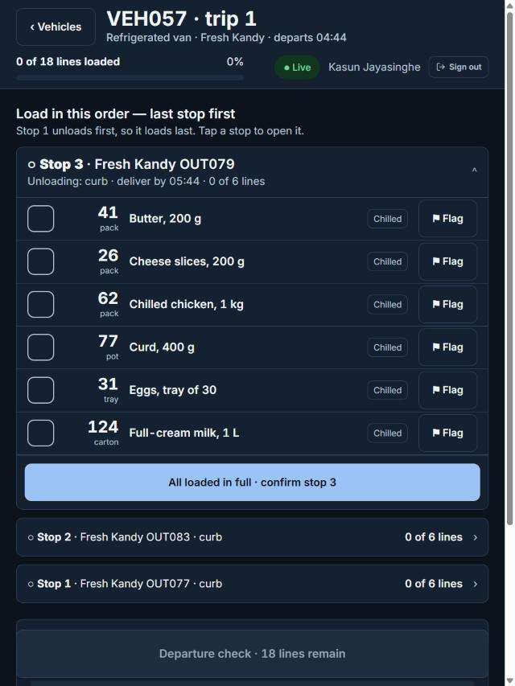</td>
</tr>
<tr><td valign="top">Landscape only. "0%Kasun Jayasinghe" runs together; quantity is small, after the name.</td><td valign="top">Portrait tablet: big quantities first, confirm under the lines, Departure check pinned at the bottom.</td></tr>
</table>

| ✗ BEFORE | ✓ AFTER |
|---|---|
| "Coconut oil, 1 L · 26 bottle" in one line of body text | 26 in 24 px bold, "bottle" under it, then the product name |
| "Confirm stop" above the lines it confirms | "All loaded in full · confirm stop 3" under the lines, full width |
| Fixed 1280 px frame; header items collide at 1024 px | Full screen on the tablet; header wraps; one column in portrait |
| Sign-out badge floating over the Departure check button | Sign-out beside the Live status in the header |

---

## Store manager

Same screen, same outlet (Fresh Kandy OUT078, whose chilled order was deferred): the content was right, the navigation and the controls were not.
> **Works at the outlet counter on a desktop or a phone.**

| Needs | → Where the app answers it |
|---|---|
| confirmation that the order was received and scheduled | a confirmation number the moment it is placed (WP-261004-...), an "Order received" notice, then Scheduled once the plan is sent |
| an expected arrival time, to schedule staff | the arrival window in large type (e.g. 04:29–04:59) on Deliveries as soon as the plan is sent |
| clear notice when an order is deferred | "Not arriving on Tuesday", the reason in plain words, and the new day (Wed 7 Oct) |
| a way to confirm receipt and report issues | Confirm: ordered / driver delivered / you received per line, Report issue per line, with a red count on the tab until done |

<table>
<tr><th align="left">✗ BEFORE</th><th align="left">✓ AFTER</th></tr>
<tr>
<td valign="top" width="50%">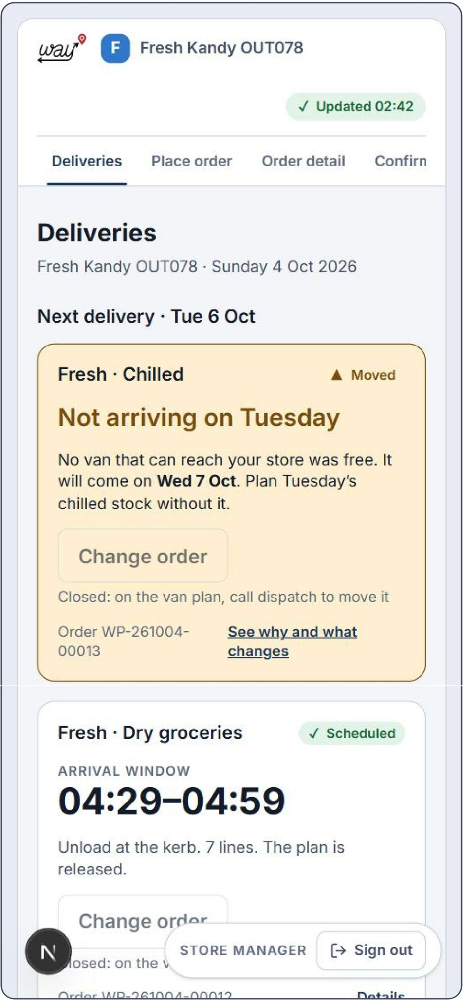</td>
<td valign="top" width="50%">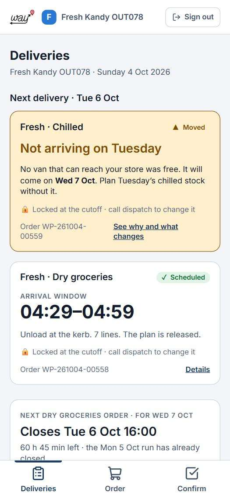</td>
</tr>
<tr><td valign="top">Four tabs run off the screen ("Confirm" cut off); a grey "Change order" that does nothing.</td><td valign="top">Bottom tab bar under the thumb; "Locked at the cutoff · call dispatch" instead of a dead button.</td></tr>
</table>

| ✗ BEFORE | ✓ AFTER |
|---|---|
| Deliveries · Place order · Order detail · Confirm delivery along the top | Deliveries · Order · Confirm in a bottom bar (top tabs on desktop); order detail opens from a delivery |
| No sign that something waits for you | Red count on Confirm, and a "Needs you" card first on Deliveries |
| Disabled "Change order" on every locked order | "🔒 Locked at the cutoff · call dispatch to change it" |
| At 03:00 Sunday: "the Sat 3 Oct run has already closed" (database on UTC) | Database runs on Sri Lanka time: dates are right between 00:00 and 05:30 |

---

**ADDED IN THE REDESIGN · NO "BEFORE" TO COMPARE**

## New screens

Screens that did not exist before, or that only became testable once Docker got its own sign-in.

| DISPATCHER | DISPATCHER |
|---|---|
| 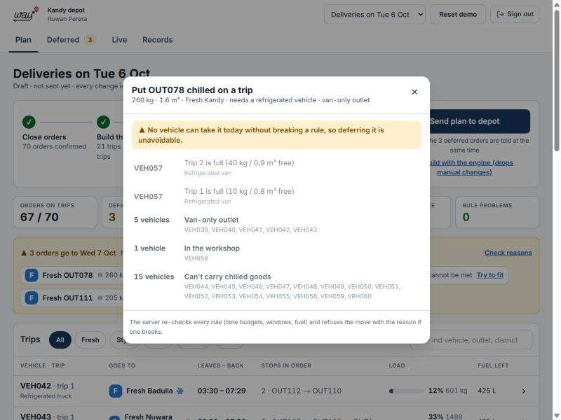 | 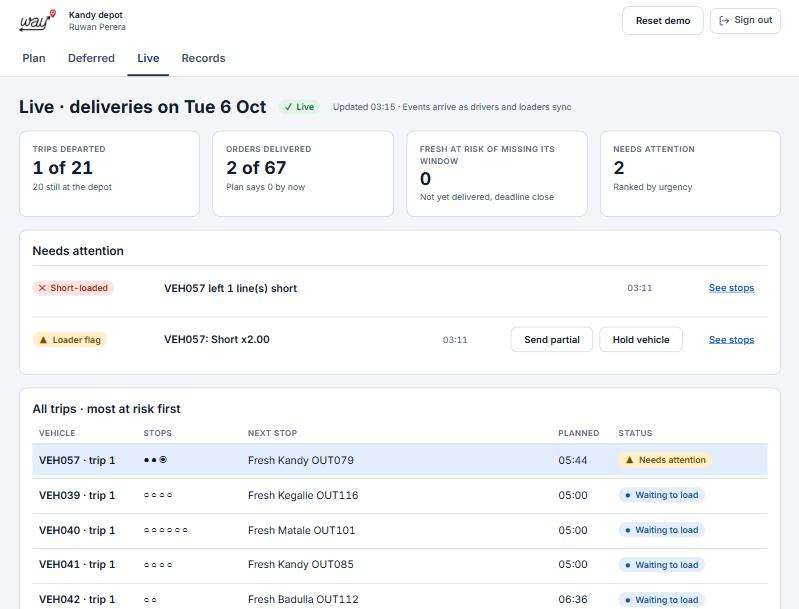 |
| **Why it can't go.** For OUT078 chilled: both VEH057 trips are full, 5 trucks can't reach a van-only outlet, VEH058 is in the workshop, 15 vehicles can't carry chilled. The deferral is provably unavoidable. | **Live, by risk.** The loader's shortfall arrives with "Send partial / Hold vehicle" replies. |

| DRIVER | DRIVER |
|---|---|
| 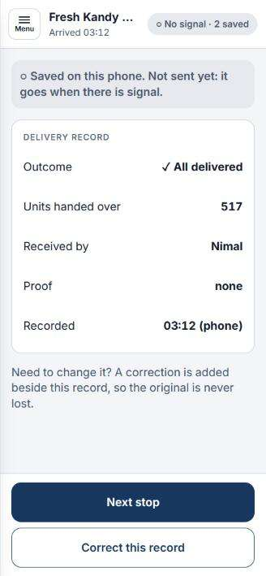 | 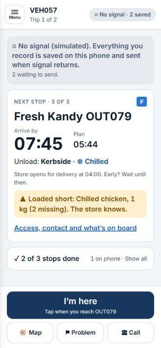 |
| **No signal is normal.** "Saved on this phone. Not sent yet." It sends itself when signal returns. | **Shortfall follows the van.** "Loaded short: Chilled chicken (2 missing). The store knows." |

| LOADER | DOCKER |
|---|---|
| 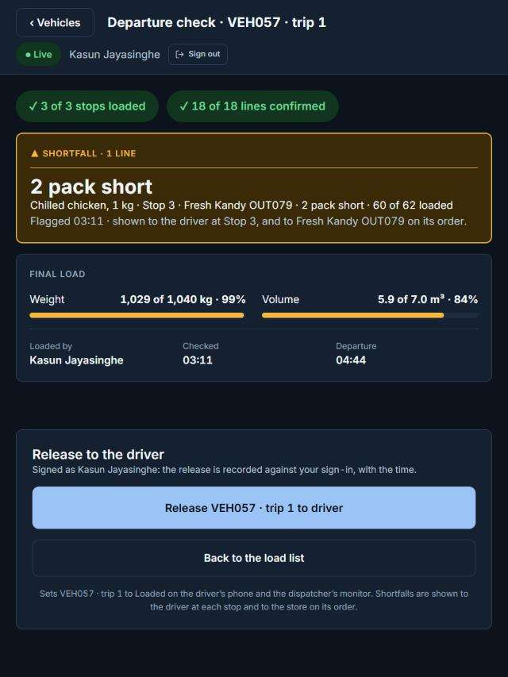 | 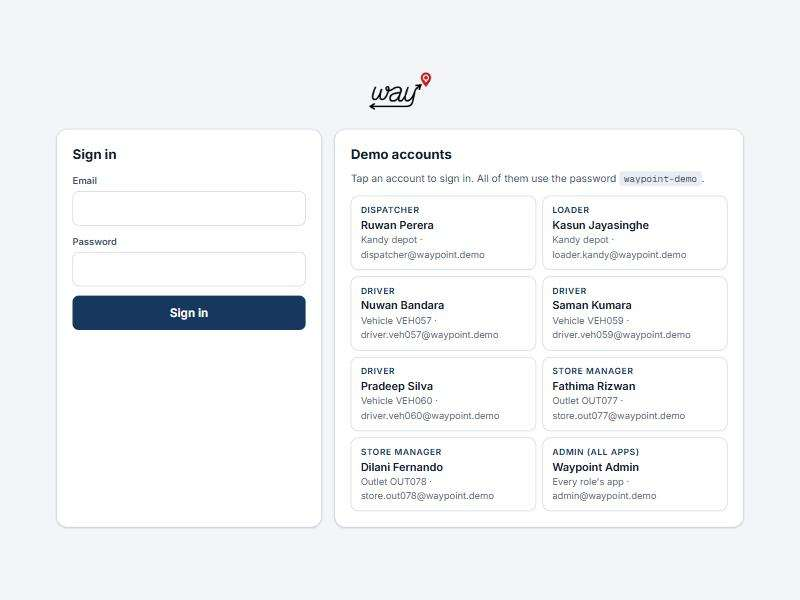 |
| **Departure check.** Release signed with the loader's own sign-in; the shortfall in large type. | **Local sign-in.** `docker compose up` works with no outside account; tap a demo account (password `waypoint-demo`). |
